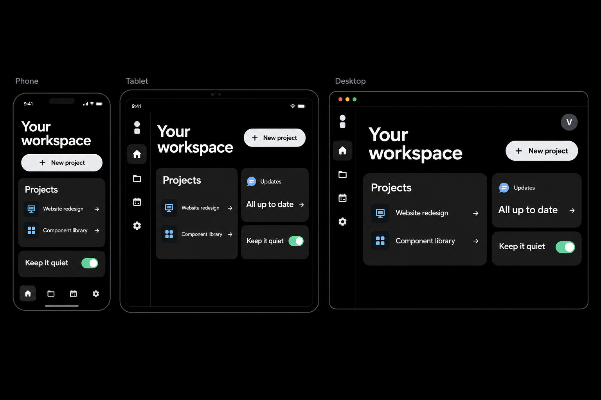

# Quiet Material

A mobile-first design system for web and native apps: pure black pages, charcoal cards, large readable type, pill controls, restrained blue/mint accents and purposeful interaction motion.

Quiet Material is an independent custom theme inspired by Material Design. It is not an official Google library or a complete implementation of Material components.



Illustrative concept, not an implementation screenshot. [Phone concept](assets/platforms/mobile-focus.png) · [Original direction](assets/approved-concept.png)

## What is included

- 94 canonical design tokens with deterministic CSS, JSON, TypeScript, Kotlin, Swift, and Dart exports.
- Mobile-first 320px baseline, 600/840/1200 window classes, safe-area support, scalable type, and accessible target sizes.
- Android Compose, Apple SwiftUI, and Flutter starter themes and adaptive examples. Native SDK builds remain pending.
- Framework-independent styles for 27 documented primitives and compositions.
- Optional progressive JavaScript for tabs, dialog triggers, selectable chips, ripple feedback, tooltip dismissal and snackbars.
- A responsive component workbench with platform guides, two additional device concepts, and three small, opt-in motion GIFs.
- Foundations, accessibility rules, component contracts, motion recipes, patterns and design-tool handoff guidance.
- A dependency-free token build and development-only jsdom tests for DOM behavior.

## Choose a platform

| Stack | Entry point |
| --- | --- |
| Web, any framework | [Web integration](docs/getting-started.md) |
| Android / Compose | [Android starter](platforms/android/README.md) |
| iOS, iPadOS, macOS / SwiftUI | [Apple Swift package](platforms/apple/README.md) |
| Android, iOS, web, Windows, macOS, Linux / Flutter | [Flutter package](platforms/flutter/README.md) |
| Another toolkit | [Resolved tokens](exports/quiet-material.tokens.resolved.json) and [platform contracts](docs/platforms.md) |

The adapters preserve native semantics and navigation. Platform compatibility is a shared design contract, not a claim that all devices have been tested.

## See the motion

The explorer’s Motion page provides Play and Stop controls; it loads static posters by default and honors reduced motion. The files below are single-cycle motion studies, not application recordings.

| Study | Active transition | Download |
| --- | --- | --- |
| Contained ripple | 350 ms | [GIF](assets/motion/ripple.gif) · [Still](assets/motion/ripple.png) |
| Switch | 250 ms thumb / 150 ms track | [GIF](assets/motion/switch.gif) · [Still](assets/motion/switch.png) |
| Bottom sheet | 350 ms | [GIF](assets/motion/sheet.gif) · [Still](assets/motion/sheet.png) |

## Start the workbench

Use Node.js 22.22.2+ in the 22.x line, 24.15.0+ in the 24.x line, or 26+. The supported engine range is `^22.22.2 || ^24.15.0 || >=26.0.0`. Run `npm ci` to install the development test dependencies. The browser runtime and styles have no dependencies; the token build itself uses only Node's standard library.

```sh
npm ci
npm run build
npm run dev
```

Open the local URL printed by the server. The entry point is index.html. Build generates CSS and all portable/native token outputs from tokens/quiet-material.tokens.json. Do not hand-edit generated files.

```sh
npm test          # Run repository tests.
npm run check    # Rebuild tokens and run tests.
```

## Use in a page

Keep the styles directory intact so quiet-material.css can import its generated tokens.css file. Serve modules over HTTP, not file://.

```html
<!doctype html>
<html lang="en">
  <head>
    <meta charset="utf-8">
    <meta name="viewport" content="width=device-width, initial-scale=1">
    <title>Quiet Material example</title>
    <link rel="stylesheet" href="./styles/quiet-material.css">
  </head>
  <body>
    <main class="qm-card">
      <h1>Make room for what matters.</h1>
      <p class="qm-muted">A focused workspace with clear actions.</p>
      <button class="qm-button qm-button--primary" id="save" type="button">Save changes</button>
    </main>
    <script type="module">
      import { initQuietMaterial, showSnackbar } from './src/quiet-material.js';
      const cleanup = initQuietMaterial(document);
      document.querySelector('#save').addEventListener('click', () => {
        showSnackbar('Example confirmation.');
      });
      // In an application, call cleanup() before disposing this enhanced root.
    </script>
  </body>
</html>
```

For a local workspace integration that already resolves this package, the exports are:

```js
import '@quiet-material/core/styles.css';
import { initQuietMaterial, showSnackbar } from '@quiet-material/core';
```

This package is private and unpublished; the example is not an instruction to install it from the public npm registry. CSS import support depends on your build tool. The package also exposes ./tokens.css and ./tokens.json. Product actions, routing, persistence and data loading remain your application's responsibility.

## Documentation

| Guide | Covers |
| --- | --- |
| [Getting started](docs/getting-started.md) | Commands, imports and integration lifecycle |
| [Platforms](docs/platforms.md) | Android, Apple, Flutter, desktop coverage and native component mappings |
| [Mobile first](docs/mobile-first.md) | Window classes, safe areas, text scaling, touch, keyboard and RTL |
| [Motion gallery](docs/motion-gallery.md) | Three small GIFs, static posters, timings and reproducible generator |
| [Foundations](docs/foundations.md) | Principles, exact colors, type, spacing, shape and token architecture |
| [Components](docs/components.md) | Catalog, states, markup, keyboard contracts and JavaScript lifecycle |
| [Motion](docs/motion.md) | Custom durations/easings, recipes and reduced motion |
| [Accessibility](docs/accessibility.md) | Contrast, focus, semantics, input and acceptance checks |
| [Patterns](docs/patterns.md) | Forms, settings, navigation, errors and notifications |
| [Design-tool handoff](docs/design-handoff.md) | Variable and component mapping for a future design library |
| [Governance](docs/governance.md) | Scope, limitations, versioning and release gates |
| [Contributing](CONTRIBUTING.md) | Local commands and change expectations |
| [Changelog](CHANGELOG.md) | Release history |

## Scope and ownership

The supported theme is dark. Current native-browser features such as dialog, popover and :has() are used; verify your browser support policy before integrating. The web styles can be used from any framework. Native starters supply themes and core compositions, with remaining catalog items mapped to toolkit controls. They have not been compiled or device-tested in this environment. An editable Figma library, advanced data widgets and backend functionality are not included.

Accessibility is designed into the contracts, including visible focus, semantic HTML and reduced motion. A consuming product still needs keyboard, screen-reader, zoom and flow testing; this repository does not claim universal accessibility certification.

The source package is private and unpublished. No public license grant is supplied. See [governance](docs/governance.md) before distribution or publication.

## Validation record

See [validation and remaining manual checks](docs/validation.md). The downloadable archive also includes a [quick entry guide](START-HERE.md).
