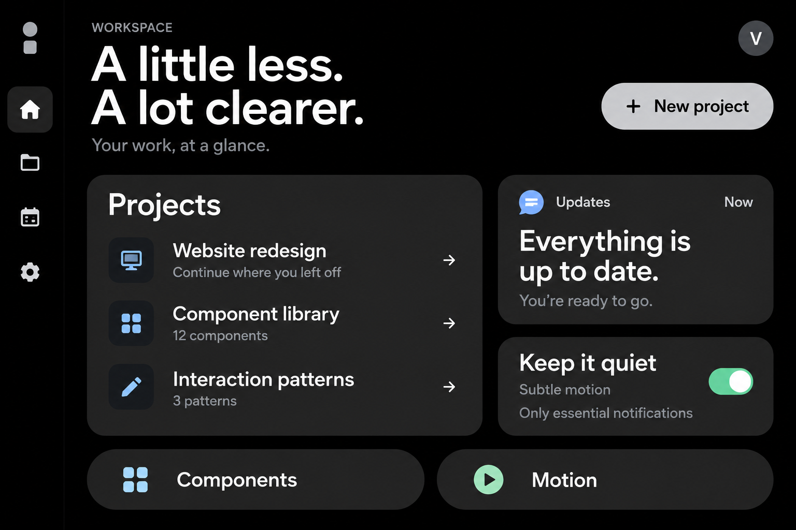

# Quiet Material

A calm, black-first design system for the web: pure black pages, charcoal cards, large readable type, pill controls, restrained blue/mint accents and purposeful interaction motion.

Quiet Material is an independent custom theme inspired by Material Design. It is not an official Google library or a complete implementation of Material components.



## What is included

- Source design tokens and generated CSS variables for color, type, spacing, shape, motion and sizing.
- Framework-independent styles for 27 documented primitives and compositions.
- Optional progressive JavaScript for tabs, dialog triggers, selectable chips, ripple feedback, tooltip dismissal and snackbars.
- A local component workbench with practical examples.
- Foundations, accessibility rules, component contracts, motion recipes, patterns and design-tool handoff guidance.
- A dependency-free token build and development-only jsdom tests for DOM behavior.

## Start the workbench

Use Node.js 22.22.2+ in the 22.x line, 24.15.0+ in the 24.x line, or 26+. The supported engine range is `^22.22.2 || ^24.15.0 || >=26.0.0`. Run `npm ci` to install the development test dependencies. The browser runtime and styles have no dependencies; the token build itself uses only Node's standard library.

```sh
npm ci
npm run build
npm run dev
```

Open the local URL printed by the server. The entry point is index.html. Build generates styles/tokens.css from tokens/quiet-material.tokens.json.

```sh
npm test          # Run repository tests.
npm run check    # Rebuild tokens and run tests.
```

## Use in a page

Keep the styles directory intact so quiet-material.css can import its generated tokens.css file. Serve modules over HTTP, not file://.

```html
<!doctype html>
<html lang="en">
  <head>
    <meta charset="utf-8">
    <meta name="viewport" content="width=device-width, initial-scale=1">
    <title>Quiet Material example</title>
    <link rel="stylesheet" href="./styles/quiet-material.css">
  </head>
  <body>
    <main class="qm-card">
      <h1>Make room for what matters.</h1>
      <p class="qm-muted">A focused workspace with clear actions.</p>
      <button class="qm-button qm-button--primary" id="save" type="button">Save changes</button>
    </main>
    <script type="module">
      import { initQuietMaterial, showSnackbar } from './src/quiet-material.js';
      const cleanup = initQuietMaterial(document);
      document.querySelector('#save').addEventListener('click', () => {
        showSnackbar('Example confirmation.');
      });
      // In an application, call cleanup() before disposing this enhanced root.
    </script>
  </body>
</html>
```

For a local workspace integration that already resolves this package, the exports are:

```js
import '@quiet-material/core/styles.css';
import { initQuietMaterial, showSnackbar } from '@quiet-material/core';
```

This package is private and unpublished; the example is not an instruction to install it from the public npm registry. CSS import support depends on your build tool. The package also exposes ./tokens.css and ./tokens.json. Product actions, routing, persistence and data loading remain your application's responsibility.

## Documentation

| Guide | Covers |
| --- | --- |
| [Getting started](docs/getting-started.md) | Commands, imports and integration lifecycle |
| [Foundations](docs/foundations.md) | Principles, exact colors, type, spacing, shape and token architecture |
| [Components](docs/components.md) | Catalog, states, markup, keyboard contracts and JavaScript lifecycle |
| [Motion](docs/motion.md) | Custom durations/easings, recipes and reduced motion |
| [Accessibility](docs/accessibility.md) | Contrast, focus, semantics, input and acceptance checks |
| [Patterns](docs/patterns.md) | Forms, settings, navigation, errors and notifications |
| [Design-tool handoff](docs/design-handoff.md) | Variable and component mapping for a future design library |
| [Governance](docs/governance.md) | Scope, limitations, versioning and release gates |
| [Contributing](CONTRIBUTING.md) | Local commands and change expectations |
| [Changelog](CHANGELOG.md) | Release history |

## Scope and ownership

The supported theme is dark. Current native-browser features such as dialog, popover and :has() are used; verify your browser support policy before integrating. Framework and native mobile adapters, an editable Figma library, advanced data widgets and backend functionality are not included.

Accessibility is designed into the contracts, including visible focus, semantic HTML and reduced motion. A consuming product still needs keyboard, screen-reader, zoom and flow testing; this repository does not claim universal accessibility certification.

The source package is private and unpublished. No public license grant is supplied. See [governance](docs/governance.md) before distribution or publication.

## Validation record

See [validation and remaining manual checks](docs/validation.md). The downloadable archive also includes a [quick entry guide](START-HERE.md).
