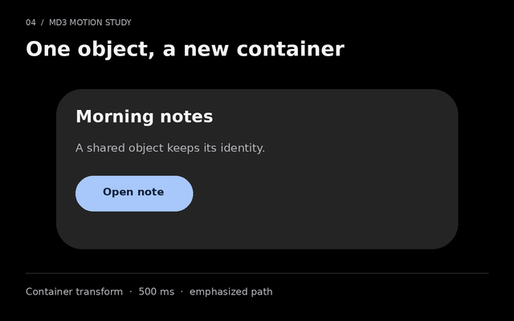
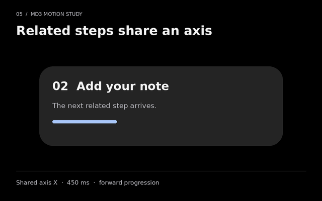
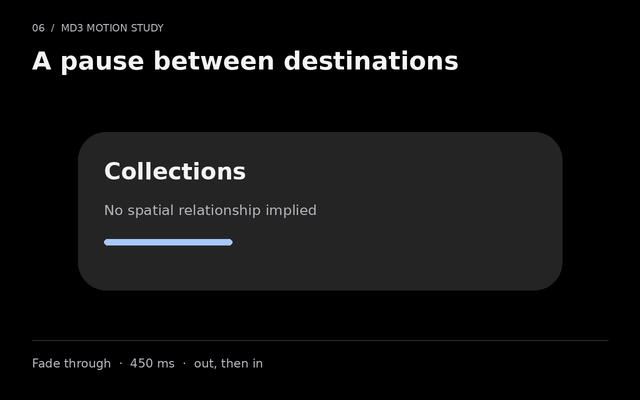
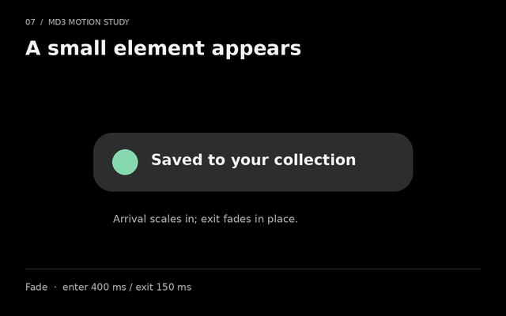

# Motion gallery

Seven authored studies illustrate Quiet Material's MD3 motion contract: press feedback, spatial and effects springs, and the four Material transition patterns. These are diagrams drawn from shared tokens, not screen recordings or native component certification. Black backgrounds, restrained color and a single cycle keep the motion easy to inspect.

The 1.4 visual migration changed no motion value, binding or API, and these studies were not re-rendered for it: every GIF, poster and manifest entry is byte-identical to 1.3. They therefore still show that release’s charcoal surfaces and pale-blue accent, and the descriptions below describe the files as they stand. They remain valid evidence because they demonstrate timing, not palette. Regenerating them reads the current token values and changes only their colors and corner radii; the durations, springs and transition bindings in the tables below are unchanged.

The images below are static posters. The explorer loads a GIF only after Play and provides Stop. System or product reduced-motion preferences keep the poster visible. Every state and explanation remains available without playing an animation.

## Press feedback


[Play the press-ripple GIF](../assets/motion/ripple.gif)

The example holds a press for the full 450 ms growth, then releases with a 375 ms linear opacity fade. Opacity enters over 105 ms; the pressed state layer is 12%. Growth follows standard easing. Actual input uses a 225 ms minimum hold and a 150 ms touch delay to distinguish a press from scrolling; the diagram begins after that delay. The user's action is never delayed by the animation. These timings follow [Material Web's ripple implementation](https://github.com/material-components/material-web/blob/main/ripple/internal/ripple.ts).

## Selection: separate spatial and effects springs


[Play the switch GIF](../assets/motion/switch.gif)

The thumb uses the standard scheme's fast spatial spring; the color uses its fast effects spring. The current finite web samples settle at approximately 338 ms and 223 ms respectively. Those durations are derived from the spring parameters and settling thresholds; they are not additional MD3 duration tokens. The drawn control is twice the web control's size for readability. Update the checked state and its accessible value immediately.

## Bottom sheet: a spatial arrival


[Play the bottom-sheet GIF](../assets/motion/sheet.gif)

The web sheet uses the standard scheme's default spatial spring for 24 px of vertical travel. Its current finite web sample settles at approximately 463 ms; opacity uses the separate default effects spring, approximately 331 ms. This shows Quiet Material's spring binding for a sheet; native sheets retain their platform's focus, dismissal, safe-area and accessibility behavior. The complete standard and expressive spring families are listed in [Motion](motion.md); each offers fast, default and slow spatial and effects springs.

## Container transform: one shared object



[Play the container-transform GIF](../assets/motion/container-transform.gif)

Use a container transform when an element becomes a larger or smaller surface representing the same object. This forward study runs for 500 ms with the exact two-segment emphasized curve. Bounds interpolate throughout, incoming detail fades over eased progress 0-0.25, and corner shape changes over 0-0.75. The return recipe is 400 ms, with its own fade and shape thresholds. These bindings follow the defaults in [MaterialContainerTransform](https://github.com/material-components/material-components-android/blob/master/lib/java/com/google/android/material/transition/MaterialContainerTransform.java).

## Shared axis: related steps



[Play the shared-axis GIF](../assets/motion/shared-axis.gif)

The horizontal study moves related steps along X with 30 logical units of travel, a fade-through split at 0.35 eased progress, and 450 ms emphasized timing. X supports horizontal sequences; Y supports vertical progression; Z uses scale for a hierarchy relationship. Reverse navigation reverses the spatial direction, and horizontal navigation accounts for right-to-left layout. Use shared axis only when the relationship explains the movement. The implementation follows [MaterialSharedAxis](https://github.com/material-components/material-components-android/blob/master/lib/java/com/google/android/material/transition/MaterialSharedAxis.java) and its [30 dp distance resource](https://github.com/material-components/material-components-android/blob/master/lib/java/com/google/android/material/transition/res/values/dimens.xml).

## Fade through: independent destinations



[Play the fade-through GIF](../assets/motion/fade-through.gif)

The outgoing destination fades away before the incoming destination becomes visible. The incoming surface scales from 0.92 to 1; the outgoing surface does not scale. The total duration is 450 ms with emphasized easing. The opacity split occurs at 0.35 of eased progress, not 35% of wall-clock time. This follows [MaterialFadeThrough](https://github.com/material-components/material-components-android/blob/master/lib/java/com/google/android/material/transition/MaterialFadeThrough.java) and [FadeThroughProvider](https://github.com/material-components/material-components-android/blob/master/lib/java/com/google/android/material/transition/FadeThroughProvider.java).

## Fade: entering and leaving an element



[Play the fade GIF](../assets/motion/fade.gif)

An entering element scales from 0.8 to 1 over 400 ms with emphasized deceleration; opacity reaches its final value during the first 0.30 of eased progress. The diagram then holds for 250 ms so the result is readable. Exit fades in place over 150 ms with emphasized acceleration and no scale change. This follows [MaterialFade](https://github.com/material-components/material-components-android/blob/master/lib/java/com/google/android/material/transition/MaterialFade.java). The reading hold is presentation timing, not an instruction to dismiss real messages after 250 ms.

## File details

| Study | Contract timing | Encoded movement sequence | Full clip |
| --- | --- | --- | --- |
| Press ripple | 450 ms held growth + 375 ms release | 830 ms | 2.58 s |
| Switch | 338 ms spatial; 223 ms effects | 340 ms | 2.09 s |
| Sheet | 463 ms spatial; 331 ms effects | 470 ms | 2.22 s |
| Container transform | 500 ms forward | 500 ms | 2.25 s |
| Shared axis X | 450 ms | 450 ms | 2.20 s |
| Fade through | 450 ms | 450 ms | 2.20 s |
| Fade | 400 ms entry + 250 ms reading hold + 150 ms exit | 800 ms | 2.55 s |

Every study is 640 × 400 pixels, under 300 KB, and adds a 700 ms reading hold before movement and 1050 ms after. Each GIF stops after one cycle. Frames are sampled at 20 ms, with a final interval of up to 30 ms to avoid very short delays that some viewers stretch. Identical frames may merge during GIF compression.

GIF timing is quantized to 10 ms. The ripple, switch and sheet sequences therefore add 5 ms, 2 ms and 7 ms respectively to their encoded final sampling interval. The implementation contract remains unchanged. GIF playback is illustrative; browser and native engines animate continuously at the available refresh rate, and a particular GIF viewer can schedule frames differently.

The generated [manifest](../assets/motion/manifest.json) records model timing, encoded timing, frame count, dimensions, byte counts and the exact contract snapshot for each study. Cubic Bézier curves are evaluated by solving x before sampling y. The emphasized curve uses both original segments. Spring diagrams interpolate the same generated trajectory samples as the web CSS; their finite duration is a web approximation of the physical spring, not a fixed native-engine promise.

## Reproduce the assets

From the repository root, with Node, Python, Pillow and DejaVu Sans installed:

```sh
npm run build
python scripts/render-motion.py
```

The generator reads `tokens/quiet-material.tokens.json` for color and geometry and `exports/quiet-material.motion.json` for motion. It draws all primitives from scratch, then writes seven GIFs, seven PNG posters and the manifest. It verifies dimensions, encoded duration, absence of looping and the 300 KB limit. Different font or Pillow versions can change byte counts without changing the contract.

## Embed without distraction

- Show the PNG poster first, with descriptive alternative text and explicit dimensions.
- Load the GIF only after Play. Keep Stop visible and restore the poster when stopped or when leaving the gallery.
- Respect both `prefers-reduced-motion: reduce` and the product's Reduce motion setting. Product settings must never override the system's request for less motion.
- Restore posters immediately if the motion preference changes during playback.
- Keep captions and resulting state descriptions available without movement.

For the complete token catalog, physical spring families, pattern API, interruption behavior and sources, see [Motion](motion.md) and [Accessibility](accessibility.md).
