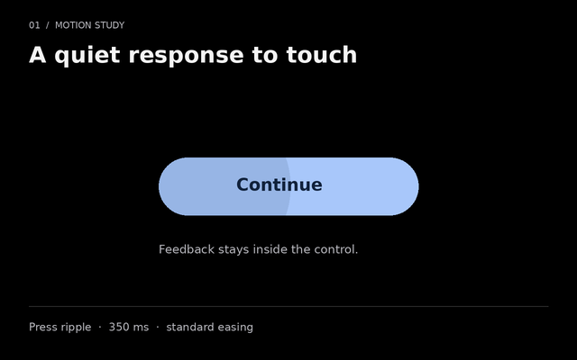
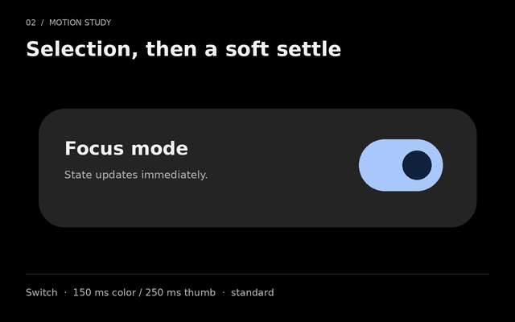
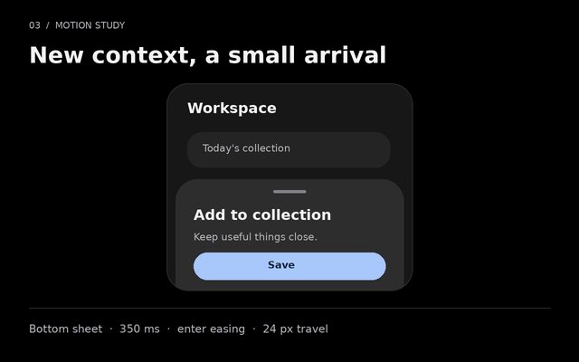

# Motion gallery

Three small, authored studies show how Quiet Material responds to input. They are diagrams of the web motion recipes, not screen recordings or native platform screenshots. The canvas stays black, the controls use the shared color tokens, and the motion stops at a useful resting state.

The images below are static posters. Open a GIF only when you want to see movement; every GIF plays one cycle and stops. The component explorer provides explicit Play and Stop controls. A system or product preference for reduced motion must keep the poster visible instead of loading the GIF.

## Press feedback



[Play the press-ripple GIF](../assets/motion/ripple.gif)

The ripple expands from the press location, clips to the button, and fades over `duration.long` (350 ms) with `easing.standard`. Its initial opacity is 16%, matching the current web state layer. The ripple reinforces activation; it never delays the action.

## Selection



[Play the switch GIF](../assets/motion/switch.gif)

The track changes color over `duration.short` (150 ms); the thumb settles over `duration.medium` (250 ms). Both use `easing.standard`. The drawn control is enlarged to twice its CSS dimensions for readability. Set the checked state immediately, including the value exposed to assistive technology; animation only explains the change visually.

## Bottom sheet



[Play the bottom-sheet GIF](../assets/motion/sheet.gif)

The sheet arrives with a fade and 24 px vertical translation over `duration.long` (350 ms), using `easing.enter`. It does not travel across the full screen. This is the web sheet recipe; native adapters should retain their platform's focus, dismissal, safe-area, and accessibility behavior.

## File details

| Study | Active transition | Reading holds | Full clip | Canvas |
| --- | --- | --- | --- | --- |
| Press ripple | 350 ms | 700 ms before, 1050 ms after | 2.10 s | 640 × 400 |
| Switch | 250 ms; color finishes at 150 ms | 700 ms before, 1050 ms after | 2.00 s | 640 × 400 |
| Sheet | 350 ms | 700 ms before, 1050 ms after | 2.10 s | 640 × 400 |

The GIFs sample every 50 ms (20 frames per second during movement). GIF compression can merge identical frames while preserving their durations. Each file is under 300 KB. The holds make the before and after states readable; they are presentation timing, not interface latency. A GIF is a sampled illustration; CSS and native animation engines render continuously at the device's available refresh rate.

Exact dimensions, byte counts, frame counts and encoded durations are recorded in [the generated manifest](../assets/motion/manifest.json). The easing function is evaluated as a CSS cubic Bézier by solving its x-coordinate before sampling its y-coordinate.

## Reproduce the assets

From the repository root, with Python, Pillow, and DejaVu Sans installed:

```sh
python scripts/render-motion.py
```

The generator reads `tokens/quiet-material.tokens.json`, draws all primitives from scratch, and writes three GIFs, three PNG posters, and the manifest. It verifies canvas dimensions, encoded duration, absence of a looping extension, and the size limit before succeeding. The committed assets were rendered with Pillow 12.3.0; different font or Pillow builds can produce different byte counts without changing the motion recipe.

## Embed without distraction

- Render the PNG poster first, with descriptive alternative text and explicit width and height.
- Load the GIF only after a Play action. Keep a visible Stop control and reset it to the poster on Stop.
- If `prefers-reduced-motion: reduce` or the local Reduce motion setting is active, keep the static poster. A local setting must never override the system's request for less motion.
- If the preference changes while the GIF is visible, replace it with the poster immediately. Do the same when leaving the gallery.
- Keep captions and state descriptions available without playback. Do not put required instructions only inside the animation.

For implementation tokens and broader interaction rules, see [Motion](motion.md) and [Accessibility](accessibility.md).
